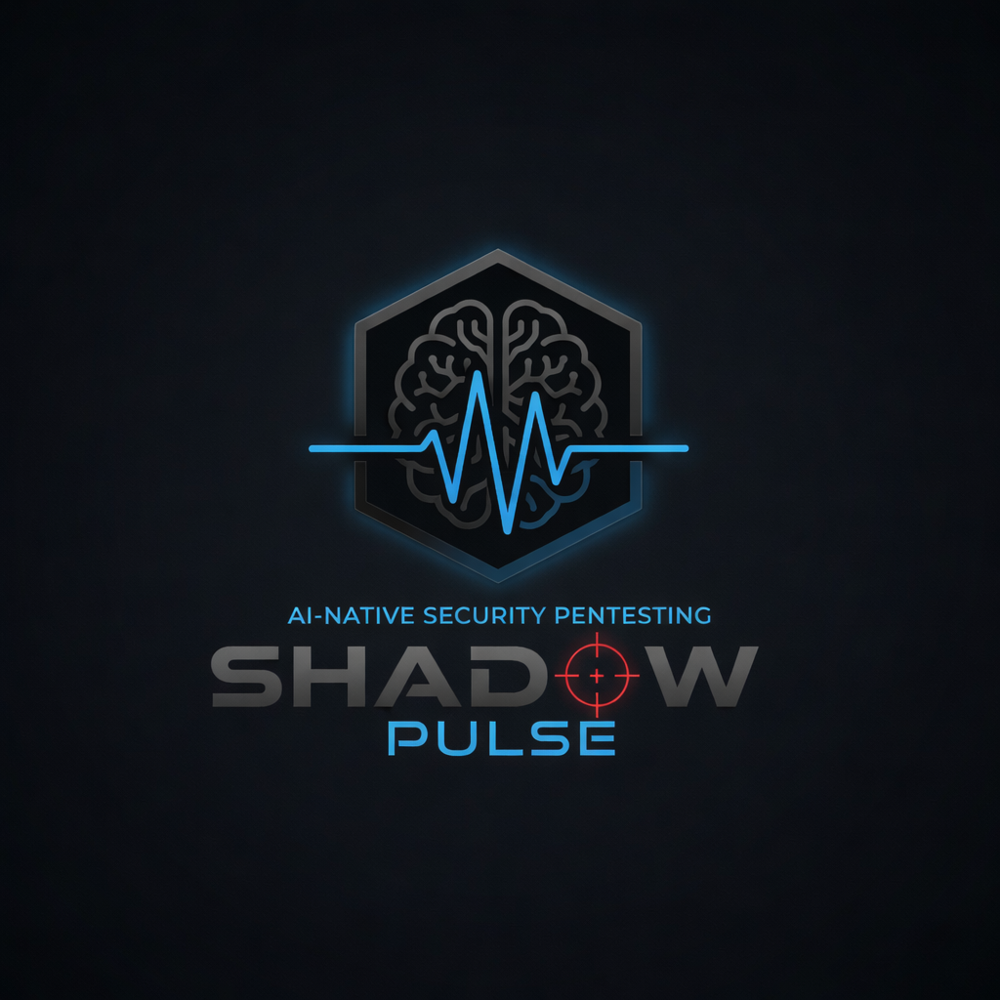
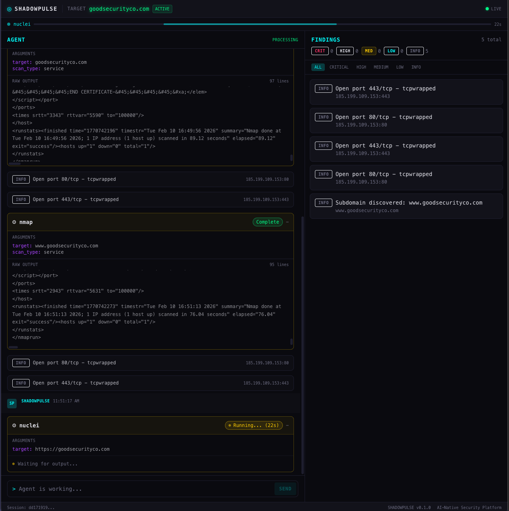
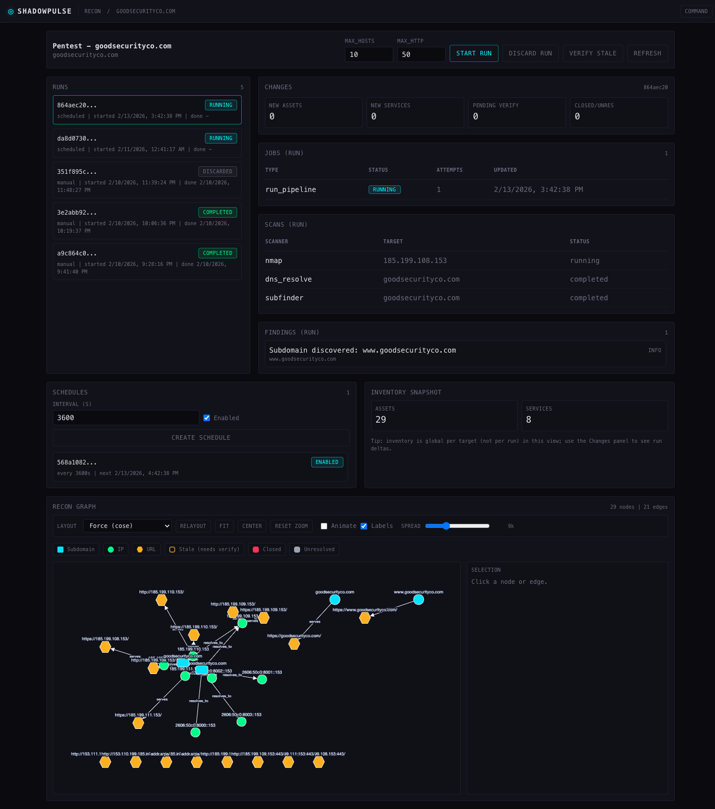
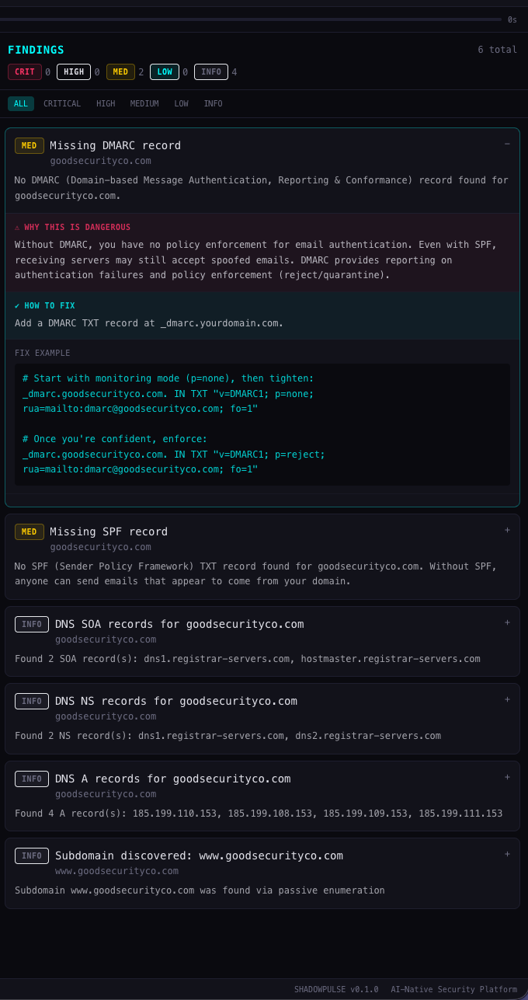

<p align="center">
  <!-- TODO: Replace with actual logo -->
  
</p>

<h3 align="center">AI-Native Security Pentesting Command Center</h3>

<p align="center">
  Intelligent reconnaissance automation powered by LLMs and 12 integrated security scanners.
</p>

<p align="center">
  <a href="#features">Features</a> &middot;
  <a href="#screenshots">Screenshots</a> &middot;
  <a href="#quick-start">Quick Start</a> &middot;
  <a href="#architecture">Architecture</a> &middot;
  <a href="#tech-stack">Tech Stack</a> &middot;
  <a href="#contributing">Contributing</a>
</p>

<p align="center">
  <!-- TODO: Replace with real badge URLs once CI is set up -->
  
  
  
  
  
  
</p>

---

## What is SHADOWPULSE?

SHADOWPULSE combines the intelligence of large language models with battle-tested security tools to create an autonomous pentesting assistant. Point it at a target, and it will enumerate subdomains, scan ports, probe web services, and discover vulnerabilities — either through an AI-driven chat interface or a deterministic recon pipeline.

**Two modes of operation:**

| | Chat Mode | Recon Mode |
|---|---|---|
| **How it works** | Conversational AI agent orchestrates scans via tool-use | Deterministic multi-stage pipeline with continuous monitoring |
| **Best for** | Exploratory testing, ad-hoc queries, targeted deep-dives | Systematic attack surface mapping, scheduled monitoring |
| **Output** | Real-time findings streamed via WebSocket | Structured inventory with change detection |

---

## Features

**AI-Powered Reconnaissance**
- Conversational chat interface powered by Claude or GPT-4 via LiteLLM
- LLM orchestrates 12 scanners autonomously through tool-use loops
- Streaming responses and real-time scan updates via WebSocket

**Deterministic Recon Pipeline**
- Multi-stage pipeline: Subfinder → DNS → Nmap → httpx → Nuclei
- Configurable scan parameters (max hosts, targets, timeouts)
- Run cancellation and progress tracking

**Continuous Monitoring & Change Detection**
- Track assets across multiple reconnaissance runs
- Detect new assets, new services, confirmed closures, and unresolved changes
- Verification jobs confirm whether assets are truly offline

**Asset Inventory (ReconGraph)**
- Discovered subdomains, IPs, URLs, and hosts with first/last seen timestamps
- Service enumeration with port, protocol, product, and version tracking
- Relationship mapping between assets (DNS resolution, redirects)

**Job Queue & Scheduling**
- Database-backed job queue — no Redis required
- Scheduled recurring scans with configurable intervals
- Concurrent worker execution with PostgreSQL `SKIP LOCKED`

**Security Hardening**
- Scope enforcement: validate every scan target against allowed domains, CIDRs, and URL prefixes
- Concurrency limits: global and per-target caps on simultaneous jobs (configurable via env vars or per-target scope)
- Retention policy: automatic purge of old raw scan output and completed runs
- Audit trail: `run_events` table logs pipeline starts, scan execution, job lifecycle, and user actions
- Session persistence: chat sessions survive navigation and browser refresh via localStorage

**12 Integrated Security Scanners**

| Category | Tools |
|---|---|
| Subdomain Enumeration | Subfinder, dnsx |
| Port Scanning | Nmap |
| Web Probing | httpx, Katana (crawler), ffuf (fuzzer) |
| Vulnerability Scanning | Nuclei, Nikto, testssl.sh |
| Custom Scanners | API security, OWASP Top 10 |

---

## Screenshots

<!-- TODO: Add screenshots of the application -->

<details>
<summary><strong>Command Center — Chat Mode</strong></summary>
<br>

<!-- TODO: Replace with actual screenshot -->
> 
>
> *The AI chat interface where you can converse with SHADOWPULSE to orchestrate scans, ask questions about findings, and get remediation advice.*

</details>

<details>
<summary><strong>Recon Mode — Target Dashboard</strong></summary>
<br>

<!-- TODO: Replace with actual screenshot -->
> 
>
> *Target overview showing reconnaissance runs, pipeline status, and discovered asset counts.*

</details>

<details>
<summary><strong>Findings Board</strong></summary>
<br>

<!-- TODO: Replace with actual screenshot -->
> 
>
> *Kanban-style findings board organized by severity — critical, high, medium, low, and informational.*

</details>

---

## Quick Start

### Prerequisites

- [Docker](https://docs.docker.com/get-docker/) & Docker Compose
- An API key from [Anthropic](https://console.anthropic.com/) or [OpenAI](https://platform.openai.com/)

### One-command launch

```bash
# Clone the repository
git clone https://github.com/your-org/shadowpulse.git
cd shadowpulse

# Configure environment
cp .env.example .env
# Edit .env and add your API key(s)

# Launch everything
make docker-up
```

That's it. Open [http://localhost:3000](http://localhost:3000) and start scanning.

```
SHADOWPULSE is running:
  Frontend: http://localhost:3000
  Backend:  http://localhost:8000
  API Docs: http://localhost:8000/docs
  Logs:     make docker-logs
  Stop:     make docker-down
```

### Local Development

```bash
# Install dependencies
make install

# Start database
make db-up

# Run backend + frontend (separate terminals, or together)
make dev
```

<details>
<summary><strong>Environment variables reference</strong></summary>

| Variable | Description | Default |
|---|---|---|
| `LLM_MODEL` | LLM model identifier | `claude-sonnet-4-5-20250929` |
| `ANTHROPIC_API_KEY` | Anthropic API key | — |
| `OPENAI_API_KEY` | OpenAI API key | — |
| `BACKEND_HOST` | Backend bind address | `0.0.0.0` |
| `BACKEND_PORT` | Backend port | `8000` |
| `NEXT_PUBLIC_API_URL` | Frontend → Backend URL | `http://localhost:8000` |
| `NEXT_PUBLIC_WS_URL` | Frontend → WebSocket URL | `ws://localhost:8000` |
| `TOOLS_CONTAINER` | Docker tools container name | `shadowpulse-tools` |
| `DATABASE_URL` | PostgreSQL connection string | `postgresql+asyncpg://...` |
| `MAX_CONCURRENT_JOBS_GLOBAL` | Max simultaneous jobs (all targets) | `5` |
| `MAX_CONCURRENT_JOBS_PER_TARGET` | Max simultaneous jobs per target | `2` |
| `RETENTION_RAW_OUTPUT_DAYS` | Days to keep raw scan output | `30` |
| `RETENTION_COMPLETED_RUNS_DAYS` | Days to keep completed runs | `90` |

</details>

---

## Architecture

```
┌─────────────────────────────────────────────────────┐
│                    Frontend (Next.js)                │
│         Chat UI  ·  Recon Dashboard  ·  Graph        │
└──────────────┬──────────────────┬───────────────────┘
               │ REST/HTTP        │ WebSocket
               ▼                  ▼
┌─────────────────────────────────────────────────────┐
│                  Backend (FastAPI)                   │
│                                                     │
│  ┌─────────────┐  ┌──────────────┐  ┌───────────┐  │
│  │ AI Agent    │  │ Recon        │  │ Job Queue │  │
│  │ Orchestrator│  │ Pipeline     │  │ & Scheduler│  │
│  └──────┬──────┘  └──────┬───────┘  └─────┬─────┘  │
│         │                │                 │        │
│         └────────┬───────┘                 │        │
│                  ▼                         │        │
│  ┌──────────────────────────┐              │        │
│  │    Scanner Interface     │◄─────────────┘        │
│  │  (12 security scanners)  │                       │
│  └────────────┬─────────────┘                       │
└───────────────┼─────────────────────────────────────┘
                │ Docker exec
                ▼
┌─────────────────────────────────────────────────────┐
│            Tools Container (Alpine)                  │
│  subfinder · nmap · httpx · nuclei · nikto · ffuf   │
│  katana · dnsx · testssl · dig · nslookup           │
└─────────────────────────────────────────────────────┘
                │
                ▼
┌─────────────────────────────────────────────────────┐
│              PostgreSQL 16                           │
│  targets · assets · services · edges · findings     │
│  runs · scans · jobs · schedules · sessions         │
│  run_events                                         │
└─────────────────────────────────────────────────────┘
```

### Data Flow

1. **Chat Mode**: User message → LLM decides which scanner to invoke → Scanner runs in tools container → Results parsed into findings → Streamed back to UI
2. **Recon Mode**: Pipeline triggered → Stages execute sequentially (subfinder → DNS → nmap → httpx → nuclei) → Assets/services ingested into inventory → Changes detected against previous runs

---

## Tech Stack

| Layer | Technology |
|---|---|
| **Frontend** | Next.js 14, React 18, TypeScript, Tailwind CSS, Cytoscape.js |
| **Backend** | FastAPI, SQLAlchemy 2.0 (async), Alembic, LiteLLM, Pydantic v2 |
| **Database** | PostgreSQL 16 via asyncpg |
| **Real-time** | WebSockets for live scan updates and chat streaming |
| **AI/LLM** | Claude (Anthropic) or GPT-4 (OpenAI) via LiteLLM abstraction |
| **Security Tools** | Subfinder, Nmap, httpx, Nuclei, Nikto, Katana, ffuf, dnsx, testssl.sh |
| **Infrastructure** | Docker Compose, multi-arch (ARM64 + x86_64) |

---

## Project Structure

```
shadowpulse/
├── backend/
│   ├── main.py              # FastAPI application entry point
│   ├── config.py             # Environment & settings
│   ├── database.py           # SQLAlchemy models
│   ├── agent/                # LLM orchestrator, tools, prompts
│   ├── scanners/             # 12 scanner implementations
│   ├── pipeline/             # Deterministic recon pipeline
│   ├── recongraph/           # Asset inventory & normalization
│   ├── routers/              # API endpoints
│   ├── jobqueue/             # DB-backed job queue
│   ├── scheduler/            # Recurring scan scheduler
│   ├── worker/               # Job execution worker
│   ├── websocket/            # WebSocket connection manager
│   └── alembic/              # Database migrations
├── frontend/
│   ├── app/                  # Next.js pages & routing
│   ├── components/           # React components (chat, findings, recon)
│   ├── lib/                  # API client & TypeScript types
│   └── hooks/                # Custom React hooks
├── docker/                   # Dockerfiles (backend, frontend, tools)
├── docker-compose.yml        # Multi-service orchestration
├── Makefile                  # Development commands
└── .env.example              # Environment template
```

---

## API Overview

SHADOWPULSE exposes a REST API with interactive Swagger docs at `/docs`.

<details>
<summary><strong>Endpoints</strong></summary>

| Method | Endpoint | Description |
|---|---|---|
| `POST` | `/api/targets` | Create a new target |
| `GET` | `/api/targets` | List all targets |
| `GET` | `/api/targets/{id}` | Get target details |
| `POST` | `/api/targets/{id}/pipeline` | Start a recon pipeline run |
| `GET` | `/api/targets/{id}/assets` | List discovered assets |
| `GET` | `/api/targets/{id}/services` | List discovered services |
| `GET` | `/api/targets/{id}/edges` | List asset relationships |
| `GET` | `/api/targets/{id}/changes` | Get change detection results |
| `GET` | `/api/targets/{id}/events` | List audit trail events |
| `POST` | `/api/targets/{id}/schedules` | Create recurring scan schedule |
| `POST` | `/api/sessions` | Create a chat session |
| `POST` | `/api/sessions/{id}/chat` | Send a chat message |
| `WS` | `/ws/{session_id}` | WebSocket for real-time updates |

</details>

---

## Makefile Commands

| Command | Description |
|---|---|
| `make docker-up` | Build and start all services |
| `make docker-down` | Stop all services |
| `make docker-logs` | Tail logs for all services |
| `make install` | Install backend + frontend dependencies locally |
| `make dev` | Start backend and frontend in dev mode |
| `make dev-backend` | Start backend with hot reload |
| `make dev-frontend` | Start Next.js dev server |
| `make db-up` | Start PostgreSQL only |
| `make db-psql` | Open psql shell |
| `make db-reset` | Destroy and recreate database |
| `make tools-build` | Build the security tools container |
| `make tools-shell` | Shell into the tools container |

---

## Roadmap

- [x] Target-first data model with PostgreSQL
- [x] 12 integrated security scanners
- [x] AI chat mode with LLM tool-use orchestration
- [x] Deterministic recon pipeline (subfinder → DNS → nmap → httpx → nuclei)
- [x] Asset inventory with change detection
- [x] Database-backed job queue and scheduler
- [ ] Full recon mode UI (inventory browser, change viewer)
- [x] Scope enforcement and rate limiting
- [x] Audit trail and retention policies
- [x] Session persistence across navigation
- [ ] Multi-user authentication
- [ ] Export reports (PDF, JSON, CSV)
- [ ] Plugin system for custom scanners
- [ ] CI/CD integration for scheduled security checks

---

## Contributing

Contributions are welcome! Please read the contributing guidelines before submitting a pull request.

1. Fork the repository
2. Create your feature branch (`git checkout -b feature/amazing-feature`)
3. Commit your changes (`git commit -m 'Add amazing feature'`)
4. Push to the branch (`git push origin feature/amazing-feature`)
5. Open a Pull Request

---

## Disclaimer

SHADOWPULSE is intended for **authorized security testing only**. Always ensure you have explicit written permission before scanning any target. Unauthorized scanning is illegal and unethical. The authors are not responsible for misuse of this tool.

---

## License

This project is licensed under the MIT License — see the [LICENSE](LICENSE) file for details.

---

<p align="center">
  <sub>Built with caffeine and Claude by the Good Security team.</sub>
</p>
